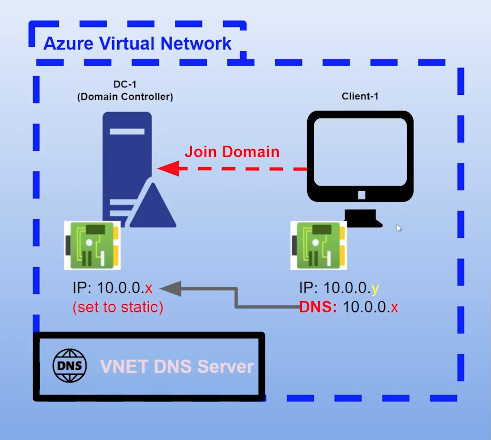
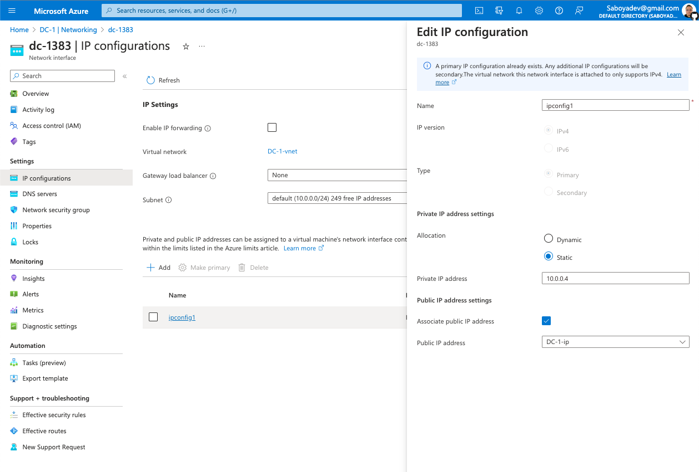
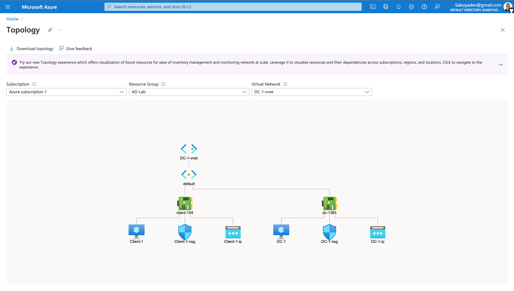
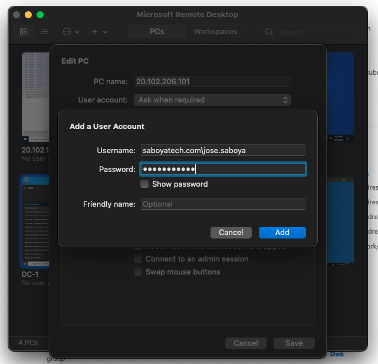
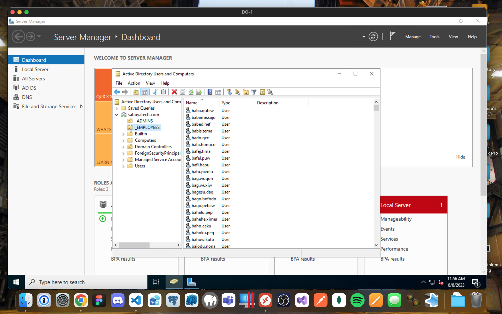

<p align="center">
 
</p>

<h1>On-premises Active Directory Deployed in the Cloud (Azure)</h1>

---

**_This tutorial outlines the implementation of on-premises Active Directory within Azure Virtual Machines._**

<p>
  
</p>

<h2>Environments and Technologies Used</h2>

---

- Microsoft Azure (Virtual Machines/Compute)
- Remote Desktop
- Active Directory Domain Services
- PowerShell
  <br  />

<h2>Operating Systems Used </h2>

---

- Windows Server 2022 Datacenter - x64 Gen2
- Windows 10 Pro, version 22H2 - x64 Gen 1
  <br  />

<h2>Objectives</h2>

---

- _Create Resources_
- _Ensure Connectivity between the client and Domain Controller_
- _Install Active Directory_
- _Create an Admin and Normal User Account in AD_
- _Join Client-1 to your domain (saboyatech.com)_
- _Setup Remote Desktop for non-administrative users on Client-1_
- _Create a PowerShell script to add additional users and attempt to log into client-1 with one of the users_
  <br  />

<h2>Deployment and Configuration Steps</h2>

---

<h3 align="center">"Setup Resources in Azure"</h3>

<h4>Domain Controller VM</h4>

- Create the Domain Controller VM (Windows Server 2022) and name it“**DC-1**”
- Create a **resource group** that will be used by all the VMs
- Make sure to select at least a 2vcpus so the process will be smoother
- Remember the name of the **vnet** being created since it will be used by the client VM.
- Set the **Domain Controller’s NIC Private IP** address to be **static** by going to the Networking settings, select the Network Interface **dc-1383**, go to the **IP configurations**, and click on **ipconfig1**
<p>
  
  
  
</p>
<br  />

<h4>Client VM</h4>

- Create the Client VM (Windows 10 Pro) and name it **“Client-1”**.
- Use the same **Resource Group** and **vnet** that was created in the previous step

<p>
  
</p>
<br  />

<h3 align="center">"Ensure Connectivity Between the Client and Domain Controller"</h3>
<br />

<h4>Network Topology</h4>

- Ensure that both VMs are in the same vnet (you can check the topology with Network Watcher)

<p>
  
</p>
<br />

<h4>Ping DC-1</h4>

- Login to **DC-1** and go to **Windows Defender Firewall with Advanced Security** to enable **ICMPv4** traffic on **ICMP Echo** under **Local subnet**
- Login to **Client-1** with Remote Desktop and ping **DC-1’s private IP address**
  <br  />

<p>
  
</p>
<br  />

```shell
ping <DC-1's Local IP address>
```

<br  />

<p>
  
</p>
<br  />

<h3 align="center">"Active Directory"</h3>

<h4>Installation:</h4>

- Login to **DC-1** and select **Add roles and features** on the dashboard of **Server Manager**.

<p >
  
</p>
<br  />

- Installation type is **Role-based or feature-based installation**.
- Select **DC-1** as your server to add **Active Directory**.
- When you select **Active Directory Domain Services**, you will get prompted with additional role services to install.
- Select **Add Features**.
- Go through the remaining process of the installation.
<p>
  
</p>
  
</p>
<br  />

<h4>Promote DC-1 as a Domain Controller:</h4>

- Click on **Promote this server to a domain controller**.

<p>
  
</p>
<br  />

- Setup a new **forest** and create the **root domain name**, I just decided to call it **saboyatech.com**
- Setup a **DSRM** password.
- Skip the DNS Options.
- Confirm the Automatic NetBIOS domain name created **(_Should be the domain name you created with out the .com, .net, etc all UPPERCASE_)**.
- You could leave the paths all default.
- Finish the installation and **Restart** the VM.
<p>
  
</p>
<br  />

- Log back into **DC-1** as **User:** saboyatech.com\labuser.

<p>
  
</p>
<br />

<h3 align="center">"Create Users in AD"</h3>
<br />

<h4>Active Directory Users and Computers:</h4>

- Create two Organizational Units **(OUs)** called **“\_EMPLOYEES”** and **"\_ADMINS"** by right clicking the **domain**, select **New** and **Organizational Unit**.

<p>
  
</p>
<br  />

- Create a new **admin** but instead of creating it from scratch, you can copy another admin object and clone it to safe you from having to add manually every single group.

<p>
  
</p>
<br  />

- Notice how this **Admin** is already a member of the different **Security Groups**, since we cloned an Admin user.

<p>
  
</p>
<br  />

- Logout from the Remote Desktop connection to **DC-1** and log back in now as **“saboyatech.com\jose.saboya”** **(replace it with the user you created)**. I will now use **jose.saboya** as my admin account from now on:

<p>
  
</p>
<br />

<h3 align="center">"Join Computers to Domain (saboyatech.com)"</h3>
<br />

<h4>DNS:</h4>

- From the **Azure Portal**, set **Client-1’s DNS** settings to the **DC’s Private IP address**.
- Restart **Client-1**.

<p>
  
</p>

<h4>Join Domain:</h4>

- Login to **Client-1** (Remote Desktop) as the **original local admin (labuser)**.
- Once you have input the **domain** that you want to join, it will prompt you for an **admin** to authorize the request.
- The computer will restart.

<p>
  
  
  
</p>
<br />

- Login to the **DC-1** (Remote Desktop) and verify **Client-1** shows up in **Active Directory Users and Computers (ADUC)** inside the **“Computers”** container on the root of the domain.

<p>
  
</p>

<h3 align="center">"Remote Desktop for Non-Admin Users"</h3>
<br />

- Log into **Client-1** as **saboyatech.com\jose.saboya** and open **system properties**.

- Click **“Remote Desktop”**.

- Allow **“Domain Users”** access to **remote desktop**.

- You can now log into Client-1 as a normal, non-administrative user now.

- Normally you’d want to do this with Group Policy that allows you to change MANY systems at once (maybe a future lab):

<p>
  
  
</p>
<br />

<h3 align="center">"Automate User Creation"</h3>

<h4>PowerShell Magic:</h4>

- Login to **DC-1** with the **admin** account ex: **saboyatech.com\jose.saboya**
- Open **PowerShell_ise** as an administrator.
- Create a new File and paste the contents of this [script](https://github.com/SaboyaTech/AD-Scripts/blob/main/Create-Users.ps1).
- Run the script and observe the accounts being created.
- The script will automatically create **10k** users **automatically** and placed them into the **\_EMPLOYEES OU**.

<p>
  
</p>
<br  />

- When finished, open **ADUC** **(_Active Directory Users and Computers_)** and observe the accounts in the appropriate **OU**.

<p>
  
</p>
<br  />

- Pick a random user and try to log into **client-1**.
- **Tip:** Take note of the password in the **PowerShellscript**.
<p>
  
  
  
</p>
<br />
<br />

<h3>*Close your Remote Desktop connection, delete the Resource Group(s) created at the beginning of this tutorial, and verify Resource Group deletion.*</h3>
